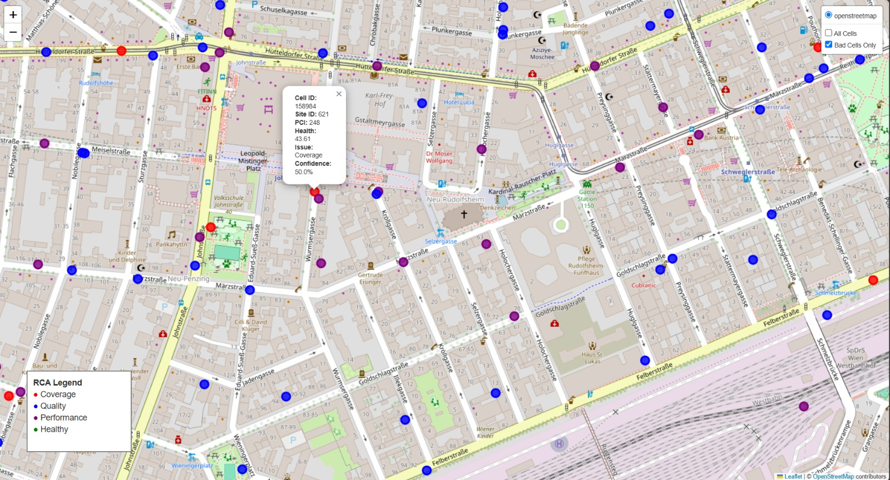
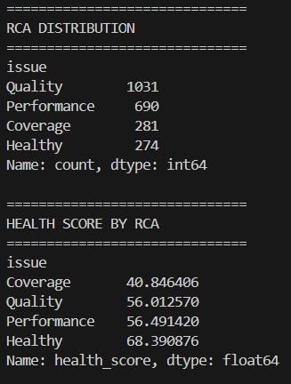
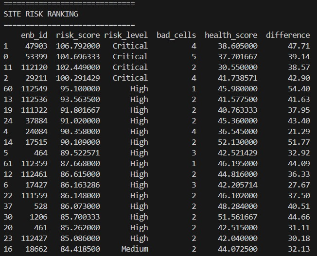
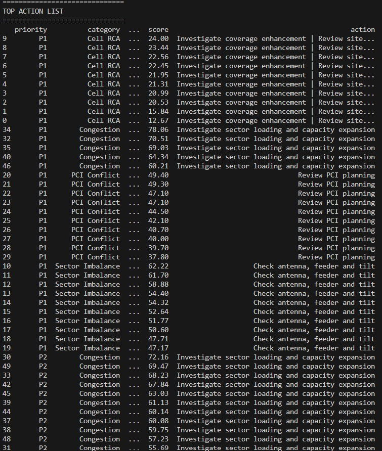

# Telecom Network Intelligence Platform

## Overview

Telecom Network Intelligence Platform is a Python-based LTE network optimization and analytics solution that combines inventory, drive-test, and scanner data to identify network performance issues and generate optimization recommendations.

The platform performs KPI aggregation, health scoring, root cause analysis, PCI planning checks, congestion detection, overshooting analysis, sector imbalance detection, neighbor analysis, and site risk ranking.

---

## Features

### Cell Intelligence

* KPI aggregation from multiple network data sources
* Median RSRP, RSRQ, SINR, throughput, pathloss, and timing advance calculations
* Cell health scoring

### Root Cause Analysis

* Coverage issue identification
* Quality issue identification
* Performance issue identification
* Confidence scoring

### Optimization Analytics

* PCI Reuse Analysis
* PCI Conflict Detection
* Congestion Detection
* Overshooting Detection
* Neighbor Analysis
* Sector Imbalance Analysis

### Site Intelligence

* Site-level KPI aggregation
* Critical Site Ranking
* Site Risk Ranking

### Recommendation Engine

* Automated optimization recommendations
* Prioritized action generation

### Visualization

* Interactive LTE network map using Folium
* RCA-based cell visualization
* Layer selection for all cells and unhealthy cells

---

## Project Architecture

Raw Network Data

↓

Cell Intelligence Engine

↓

Health Scoring Engine

↓

Root Cause Analysis Engine

↓

Optimization Analytics

├── PCI Analysis

├── Congestion Analysis

├── Overshooting Analysis

├── Neighbor Analysis

└── Sector Imbalance Analysis

↓

Site Intelligence Engine

↓

Action Recommendation Engine

↓

Reports and Interactive Maps

---

## Outputs

The platform generates:

* Cell Intelligence Report
* Site Intelligence Report
* RCA Report
* Site Risk Ranking
* PCI Analysis Report
* Congestion Analysis Report
* Overshooting Analysis Report
* Neighbor Analysis Report
* Action Recommendation Report
* Interactive Network Map

---

## Sample Outputs

### Network Visualization

### RCA Analytics

### Site Risk Ranking

### Action Recommendation Engine

---

## Technologies

* Python
* Pandas
* NumPy
* Folium
* OpenStreetMap

---

## Future Improvements

* Multi-technology support (2G/3G/4G/5G)
* Streamlit dashboard
* Real-time KPI ingestion
* Machine Learning based anomaly detection
* Automated optimization workflows
